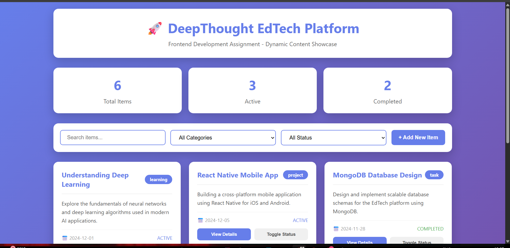

# 🚀 DeepThought Frontend Development Assignment

## 📋 Table of Contents
- [Overview](#overview)
- [Demo](#demo)
- [Features](#features)
- [Technical Approach](#technical-approach)
- [Architecture](#architecture)
- [Installation & Usage](#installation--usage)
- [Code Structure](#code-structure)
- [Design Decisions](#design-decisions)
- [Future Enhancements](#future-enhancements)
- [Tech Stack](#tech-stack)
- [Author](#author)

---

## 🎯 Overview

This project is a frontend development assignment for the **DeepThought Frontend Intern** position. It demonstrates the creation of a dynamic, responsive web application using **HTML, CSS, and Vanilla JavaScript** with a focus on:

- **Comprehension of Documentation** - Understanding requirements and implementing accordingly
- **Aesthetic Sense** - Creating visually appealing, modern UI/UX
- **Execution of Logic** - Building interactive, functional features with clean code

The application showcases a content management interface for an EdTech platform, featuring dynamic filtering, search functionality, and real-time statistics.

---

## 🎥 Demo



**Live Demo**: [View Live Application](https://khushi858.github.io/Deepthought/)  
**GitHub Repository**: [Your Repo Link](https://github.com/khushi858/Deepthought.git)

---

## ✨ Features

### Core Functionality
- ✅ **Dynamic Content Rendering** - Cards generated from JSON data
- ✅ **Real-time Search** - Instant filtering by title/description
- ✅ **Multi-level Filtering** - Category and status-based filters
- ✅ **Live Statistics Dashboard** - Auto-updating counters
- ✅ **Interactive Cards** - Hover effects and animations
- ✅ **Status Management** - Toggle between Active/Completed/Pending
- ✅ **Add New Items** - Dynamically create new content
- ✅ **Responsive Design** - Mobile, tablet, and desktop compatible

### User Experience
- 🎨 **Modern Gradient Design** - Purple theme with smooth transitions
- ⚡ **Smooth Animations** - Fade-in effects and hover transitions
- 📱 **Mobile-First Approach** - Optimized for all screen sizes
- 🎯 **Intuitive Interface** - Clear CTAs and visual hierarchy
- 🔍 **Smart Search** - Case-insensitive, multi-field search
- 📊 **Visual Feedback** - Color-coded status indicators

---

## 🔧 Technical Approach

### 1. **HTML Structure**
```
├── Header Section
│   ├── Title & Subtitle
│   └── Branding Elements
├── Statistics Dashboard
│   ├── Total Items Counter
│   ├── Active Items Counter
│   └── Completed Items Counter
├── Control Panel
│   ├── Search Input
│   ├── Category Filter
│   ├── Status Filter
│   └── Add New Button
├── Content Grid
│   └── Dynamic Card Components
└── Footer Section
```

**Approach:**
- Semantic HTML5 elements for accessibility
- BEM-inspired class naming convention
- Minimal DOM structure for performance
- Progressive enhancement principles

### 2. **CSS Architecture**

**Design System:**
- **Color Palette:**
  - Primary: `#667eea` (Purple)
  - Secondary: `#764ba2` (Dark Purple)
  - Success: `#4caf50` (Green)
  - Warning: `#ff9800` (Orange)
  - Neutral: `#555`, `#999`, `#f0f0f0`

- **Typography:**
  - Font Family: Segoe UI (fallback to system fonts)
  - Heading: 2.5em, 1.8em (mobile)
  - Body: 1em with 1.6 line-height

- **Spacing System:**
  - Base unit: 5px
  - Consistent padding: 20px, 25px, 30px
  - Grid gaps: 15px, 20px, 25px

**Layout Techniques:**
- CSS Grid for responsive card layout
- Flexbox for control panels and card internals
- Auto-fill grid with minmax for fluid responsiveness
- Mobile-first media queries (@768px breakpoint)

**Visual Effects:**
- Gradient backgrounds (`linear-gradient`)
- Box shadows for depth perception
- Smooth transitions (0.3s ease)
- Keyframe animations for card entrance
- Transform effects on hover

### 3. **JavaScript Logic**

**Data Structure:**
```javascript
{
  id: Number,           // Unique identifier
  title: String,        // Item title
  category: String,     // learning | project | task
  status: String,       // active | completed | pending
  description: String,  // Full description
  date: String,        // ISO date format
  priority: String     // high | medium | low
}
```

**Core Functions:**

1. **`renderContent(data)`**
   - Purpose: Dynamically generate HTML for cards
   - Input: Filtered array of content objects
   - Output: Rendered DOM elements
   - Features: Empty state handling, template literals

2. **`updateStats()`**
   - Purpose: Calculate and display statistics
   - Logic: Filter-based counting algorithm
   - Updates: Total, Active, and Completed counters

3. **`filterContent()`**
   - Purpose: Multi-criteria filtering engine
   - Combines: Search term + Category + Status
   - Flow: Get inputs → Filter data → Re-render

4. **`toggleStatus(id)`**
   - Purpose: Cycle through status states
   - Logic: Circular array rotation
   - Updates: Data + Stats + Display

5. **`addNewItem()`**
   - Purpose: Create new content dynamically
   - Features: Auto-increment ID, prepend to list

**Event-Driven Architecture:**
- Input event listeners for real-time search
- Change listeners for filter dropdowns
- Click handlers for interactive buttons
- Initialization on DOM load

---

## 🏗️ Architecture

### Design Pattern: **MVC-Inspired Structure**

```
┌─────────────────────────────────────┐
│          User Interface             │
│  (HTML Structure + CSS Styling)     │
└──────────────┬──────────────────────┘
               │
               ↓
┌─────────────────────────────────────┐
│         Event Handlers              │
│  (Search, Filter, Click Events)     │
└──────────────┬──────────────────────┘
               │
               ↓
┌─────────────────────────────────────┐
│      Controller Functions           │
│  (renderContent, filterContent)     │
└──────────────┬──────────────────────┘
               │
               ↓
┌─────────────────────────────────────┐
│         Data Model                  │
│    (contentData JSON Array)         │
└─────────────────────────────────────┘
```

**Separation of Concerns:**
- **Presentation Layer**: HTML + CSS
- **Business Logic**: JavaScript functions
- **Data Layer**: JSON objects

---

## 💻 Installation & Usage

### Prerequisites
- Modern web browser (Chrome, Firefox, Safari, Edge)
- Text editor (VS Code, Sublime Text)
- Basic understanding of HTML/CSS/JS

### Setup Instructions

1. **Clone the Repository**
```bash
git clone https://github.com/khushi858/Deepthought.git
cd Deepthought
```

2. **Open in Browser**
```bash
# Option 1: Direct open
open index.html

# Option 2: Local server (recommended)
python -m http.server 8000
# Visit: http://localhost:8000
```

3. **Or Use Live Server**
   - Install "Live Server" VS Code extension
   - Right-click `index.html` → "Open with Live Server"

### File Structure
```
deepthought-frontend-assignment/
│
├── index.html          # Main HTML file
├── README.md           # This file
├── screenshot.png      # Application preview
└── .gitignore         # Git ignore rules
```

---

## 📁 Code Structure

### HTML Organization
```html
<!DOCTYPE html>
<html>
  <head>
    <!-- Meta tags, Title -->
    <style>
      /* Embedded CSS */
    </style>
  </head>
  <body>
    <div class="container">
      <!-- Header -->
      <!-- Statistics -->
      <!-- Controls -->
      <!-- Content Grid -->
      <!-- Footer -->
    </div>
    <script>
      /* JavaScript Logic */
    </script>
  </body>
</html>
```

### CSS Methodology
- **Reset Styles** - Universal selector reset
- **Global Styles** - Body, containers
- **Component Styles** - Modular card/button styles
- **Utility Classes** - Reusable patterns
- **Responsive Styles** - Media query adaptations

### JavaScript Flow
```javascript
// 1. Data Definition
let contentData = [...];

// 2. Core Functions
function renderContent() {}
function updateStats() {}
function filterContent() {}

// 3. Helper Functions
function getStatusColor() {}
function viewDetails() {}
function toggleStatus() {}

// 4. Event Listeners
element.addEventListener('event', handler);

// 5. Initialization
updateStats();
renderContent(contentData);
```

---

## 🎨 Design Decisions

### 1. **Why Vanilla JavaScript?**
- **Requirement Compliance**: Assignment specifies vanilla JS
- **Performance**: No framework overhead
- **Learning**: Demonstrates core JS proficiency
- **Simplicity**: Single-file application

### 2. **Why Embedded Styles?**
- **Portability**: Single HTML file for easy submission
- **Simplicity**: No build process required
- **Quick Testing**: Immediate preview without setup

### 3. **Why Card-Based Layout?**
- **Modern UX Pattern**: Used by Pinterest, Trello, Google Keep
- **Scannable**: Easy to browse content
- **Responsive**: Naturally adapts to screen sizes
- **Extensible**: Easy to add new cards

### 4. **Color Psychology**
- **Purple Gradient**: Represents creativity, innovation (DeepTech)
- **White Cards**: Clean, professional look
- **Color-Coded Status**: Quick visual recognition
  - Blue (Active): In progress
  - Green (Completed): Success
  - Orange (Pending): Waiting/Warning

### 5. **Animation Choices**
- **Fade-in on Load**: Smooth entrance
- **Hover Effects**: Interactive feedback
- **Lift on Hover**: Creates depth illusion
- **Smooth Transitions**: Professional polish

---

## 👨‍💻 Author

**Your Name**  
Frontend Developer | DeepThought Intern Candidate

- 📧 Email: khushiupadhyay6829@gmail.com
- 🐙 GitHub: [Your Username](https://github.com/khushi858/)

---

## 📄 License

This project is created as part of the DeepThought internship application process.

---

## 🙏 Acknowledgments

- DeepThought team for the opportunity
- Assignment guidelines for clear requirements
- Modern web development community for inspiration

---

### ⭐ If you found this helpful, please star the repository!

**Last Updated**: December 2024  
**Version**: 1.0.0
